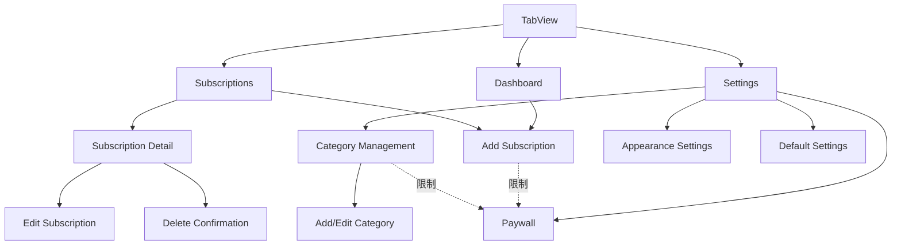

# Design Document: Subscription Tracker iOS App

## Overview

Subscription Tracker 是一个基于 SwiftUI 和 SwiftData 构建的 iOS 原生应用，采用 MVVM 架构模式。应用的核心功能是帮助用户管理订阅服务，追踪支出，并通过本地通知提醒用户即将到期的订阅。

### 核心特性

- **订阅管理**：创建、编辑、删除、归档订阅记录
- **分类系统**：通过自定义分类组织订阅
- **支出统计**：Dashboard 展示月度支出和 6 个月趋势图
- **智能提醒**：基于本地通知的到期提醒系统
- **数据同步**：可选的 iCloud 同步功能
- **免费增值模式**：免费版限制 3 个订阅和 3 个分类，Pro 版无限制
- **多货币支持**：支持多种货币的订阅记录和统计

### 技术栈

- **UI 框架**：SwiftUI (iOS 17+)
- **数据持久化**：SwiftData
- **云同步**：CloudKit (可选)
- **通知**：UserNotifications Framework
- **内购**：StoreKit 2
- **架构模式**：MVVM (Model-View-ViewModel)

## Architecture

### 整体架构

应用采用 MVVM 架构模式，结合 SwiftUI 的声明式特性和 SwiftData 的数据管理能力：

```
┌─────────────────────────────────────────────────────────┐
│                      SwiftUI Views                       │
│  (Dashboard, SubscriptionList, AddEdit, Settings, etc.) │
└────────────────────┬────────────────────────────────────┘
                     │ Binding / @Published
                     ↓
┌─────────────────────────────────────────────────────────┐
│                      ViewModels                          │
│  (DashboardViewModel, SubscriptionViewModel, etc.)      │
└────────────────────┬────────────────────────────────────┘
                     │ Business Logic
                     ↓
┌─────────────────────────────────────────────────────────┐
│                    Service Layer                         │
│  SubscriptionService, NotificationService,               │
│  SyncService, PaywallService, BillingCalculator         │
└────────────────────┬────────────────────────────────────┘
                     │ Data Operations
                     ↓
┌─────────────────────────────────────────────────────────┐
│                   SwiftData Models                       │
│        Subscription, Category, UserSettings              │
└────────────────────┬────────────────────────────────────┘
                     │ Persistence
                     ↓
┌─────────────────────────────────────────────────────────┐
│              SwiftData Store + CloudKit                  │
│           (Local Storage + Optional iCloud Sync)         │
└─────────────────────────────────────────────────────────┘
```

### 架构层次说明

#### 1. View Layer (SwiftUI Views)

负责 UI 渲染和用户交互，完全声明式，不包含业务逻辑。

主要页面：

- `DashboardView`：主页面，显示统计和趋势
- `SubscriptionListView`：订阅列表和搜索
- `SubscriptionDetailView`：订阅详情
- `AddEditSubscriptionView`：添加/编辑订阅表单
- `CategoryManagementView`：分类管理
- `SettingsView`：用户设置
- `PaywallView`：付费墙界面

#### 2. ViewModel Layer

处理业务逻辑，管理 View 状态，协调 Service 层操作。每个主要 View 对应一个 ViewModel。

主要 ViewModels：

- `DashboardViewModel`：处理统计计算和趋势数据
- `SubscriptionViewModel`：管理订阅 CRUD 操作
- `CategoryViewModel`：管理分类操作
- `SettingsViewModel`：管理用户设置

#### 3. Service Layer

封装核心业务逻辑和外部系统交互：

- **SubscriptionService**：订阅数据操作的业务逻辑
- **NotificationService**：本地通知的调度和管理
- **SyncService**：iCloud 同步逻辑
- **PaywallService**：免费/Pro 限制检查和 StoreKit 集成
- **BillingCalculator**：计费周期和续费日期计算
- **CurrencyFormatter**：货币格式化和显示

#### 4. Model Layer (SwiftData)

数据模型定义，使用 SwiftData 的 `@Model` 宏：

- `Subscription`：订阅记录
- `Category`：分类
- `UserSettings`：用户设置

### 数据流

1. **用户操作** → View 触发事件
2. **View** → ViewModel 方法调用
3. **ViewModel** → Service 层执行业务逻辑
4. **Service** → SwiftData 模型操作
5. **SwiftData** → 持久化到本地/iCloud
6. **数据变化** → SwiftData 自动通知 → View 自动更新

### 并发模型

- 使用 Swift Concurrency (async/await)
- SwiftData 操作在 `@MainActor` 上下文执行
- 后台任务（如通知调度）使用 `Task` 异步执行
- iCloud 同步使用 CloudKit 的后台队列

## Components and Interfaces

### 核心组件详细设计

#### 1. SubscriptionService

负责订阅数据的业务逻辑和验证。

```swift
@MainActor
class SubscriptionService {
    private let modelContext: ModelContext
    private let paywallService: PaywallService
    private let notificationService: NotificationService

    // 创建订阅（包含免费用户限制检查）
    func createSubscription(_ subscription: Subscription) async throws -> Bool

    // 更新订阅
    func updateSubscription(_ subscription: Subscription) async throws

    // 删除订阅（同时取消通知）
    func deleteSubscription(_ subscription: Subscription) async throws

    // 归档/取消归档
    func archiveSubscription(_ subscription: Subscription) async throws
    func unarchiveSubscription(_ subscription: Subscription) async throws

    // 查询操作
    func fetchActiveSubscriptions() -> [Subscription]
    func fetchArchivedSubscriptions() -> [Subscription]
    func searchSubscriptions(query: String) -> [Subscription]
    func fetchSubscriptionsByCategory(_ category: Category) -> [Subscription]

    // 统计计算
    func calculateMonthlyTotal(currency: String) -> Decimal
    func calculateMonthlyTrend(months: Int) -> [MonthlyExpense]
    func fetchUpcomingRenewals(days: Int) -> [Subscription]
}
```

#### 2. NotificationService

管理本地通知的调度和取消。

```swift
class NotificationService {
    // 请求通知权限
    func requestAuthorization() async -> Bool

    // 为订阅安排通知
    func scheduleNotification(for subscription: Subscription) async throws

    // 更新通知时间
    func updateNotification(for subscription: Subscription) async throws

    // 取消订阅的所有通知
    func cancelNotifications(for subscription: Subscription) async

    // 取消所有通知
    func cancelAllNotifications() async

    // 检查通知权限状态
    func checkAuthorizationStatus() async -> UNAuthorizationStatus
}
```

#### 3. BillingCalculator

核心算法：计算订阅的续费日期，处理月末和闰年等边界情况。

```swift
struct BillingCalculator {
    // 计算下次续费日期
    static func calculateNextBillingDate(
        from firstPaymentDate: Date,
        cycle: Int,
        unit: BillingCycleUnit
    ) -> Date

    // 计算从首次付款到现在的所有续费日期
    static func calculateAllBillingDates(
        from firstPaymentDate: Date,
        cycle: Int,
        unit: BillingCycleUnit,
        until endDate: Date
    ) -> [Date]

    // 将订阅金额转换为月度等效金额
    static func convertToMonthlyAmount(
        amount: Decimal,
        cycle: Int,
        unit: BillingCycleUnit
    ) -> Decimal

    // 处理月末日期（如 1/31 → 2/28）
    private static func adjustForMonthEnd(
        date: Date,
        targetMonth: Int,
        targetYear: Int
    ) -> Date

    // 检查是否为闰年
    private static func isLeapYear(_ year: Int) -> Bool
}
```

**核心算法逻辑**：

1. **月末处理**：
   - 如果首次付款日期是 31 号，下个月只有 30 天，则使用 30 号
   - 如果首次付款日期是 29/30/31 号，2 月则使用 28 号（非闰年）或 29 号（闰年）

2. **闰年处理**：
   - 如果首次付款日期是 2 月 29 日，非闰年使用 2 月 28 日
   - 年度订阅跨越闰年时正确处理 2 月 29 日

3. **计算步骤**：
   ```
   1. 从 firstPaymentDate 开始
   2. 根据 cycle 和 unit 增加时间间隔
   3. 检查目标月份的天数
   4. 如果原日期超出目标月份天数，使用该月最后一天
   5. 重复直到找到未来的日期
   ```

#### 4. PaywallService

管理免费/Pro 用户限制和 StoreKit 购买流程。

```swift
@MainActor
class PaywallService: ObservableObject {
    @Published var isProUser: Bool = false

    // 检查是否可以创建新订阅
    func canCreateSubscription(currentCount: Int) -> Bool

    // 检查是否可以创建新分类
    func canCreateCategory(currentCount: Int) -> Bool

    // 启动购买流程
    func purchaseProVersion() async throws -> Bool

    // 恢复购买
    func restorePurchases() async throws -> Bool

    // 检查购买状态
    func checkPurchaseStatus() async
}
```

#### 5. SyncService

处理 iCloud 同步逻辑。

```swift
class SyncService {
    private let modelContext: ModelContext

    // 启用 iCloud 同步
    func enableSync() async throws

    // 禁用 iCloud 同步
    func disableSync() async throws

    // 手动触发同步
    func syncNow() async throws

    // 处理同步冲突（保留最新修改）
    func resolveConflict(local: any PersistentModel, remote: any PersistentModel) -> any PersistentModel

    // 检查同步状态
    func getSyncStatus() -> SyncStatus
}
```

#### 6. CurrencyFormatter

处理货币格式化和显示。

```swift
struct CurrencyFormatter {
    // 格式化金额显示
    static func format(amount: Decimal, currency: String) -> String

    // 获取货币符号
    static func symbol(for currency: String) -> String

    // 支持的货币列表
    static let supportedCurrencies = ["USD", "CNY", "EUR", "GBP", "JPY", "HKD", "TWD"]
}
```

### UI 组件

#### 可复用组件

1. **SubscriptionCard**：订阅卡片组件
   - 显示订阅名称、金额、下次续费日期
   - 支持左滑操作（编辑、删除、归档）
   - 分类颜色标识

2. **CategoryBadge**：分类标签组件
   - 显示分类名称和颜色
   - 可点击筛选

3. **TrendChart**：趋势图组件
   - 使用 Swift Charts 绘制折线图
   - 显示过去 6 个月的支出趋势

4. **CurrencyPicker**：货币选择器
   - 下拉选择支持的货币

5. **BillingCyclePicker**：计费周期选择器
   - 选择周期数值和单位（日/周/月/年）

6. **LoadingOverlay**：加载遮罩
   - 显示加载指示器和提示文本

7. **ToastView**：Toast 提示组件
   - 显示成功/错误/信息提示

## Data Models

### SwiftData 模型定义

#### 1. Subscription Model

```swift
@Model
final class Subscription {
    @Attribute(.unique) var id: UUID
    var name: String
    var subscriptionDescription: String?
    var category: Category?
    var firstPaymentDate: Date
    var billingCycle: Int  // 周期数值，如 1, 3, 6, 12
    var billingCycleUnit: BillingCycleUnit  // 日、周、月、年
    var amount: Decimal
    var currency: String  // ISO 4217 货币代码
    var notify: Bool
    var notifyDaysBefore: Int
    var lastNotifiedDate: Date?
    var archived: Bool
    var createdAt: Date
    var updatedAt: Date

    init(
        id: UUID = UUID(),
        name: String,
        description: String? = nil,
        category: Category? = nil,
        firstPaymentDate: Date,
        billingCycle: Int,
        billingCycleUnit: BillingCycleUnit,
        amount: Decimal,
        currency: String,
        notify: Bool = true,
        notifyDaysBefore: Int = 3,
        archived: Bool = false
    ) {
        self.id = id
        self.name = name
        self.subscriptionDescription = description
        self.category = category
        self.firstPaymentDate = firstPaymentDate
        self.billingCycle = billingCycle
        self.billingCycleUnit = billingCycleUnit
        self.amount = amount
        self.currency = currency
        self.notify = notify
        self.notifyDaysBefore = notifyDaysBefore
        self.archived = archived
        self.createdAt = Date()
        self.updatedAt = Date()
    }

    // 计算下次续费日期
    var nextBillingDate: Date {
        BillingCalculator.calculateNextBillingDate(
            from: firstPaymentDate,
            cycle: billingCycle,
            unit: billingCycleUnit
        )
    }

    // 计算月度等效金额
    var monthlyEquivalent: Decimal {
        BillingCalculator.convertToMonthlyAmount(
            amount: amount,
            cycle: billingCycle,
            unit: billingCycleUnit
        )
    }
}

enum BillingCycleUnit: String, Codable {
    case day = "day"
    case week = "week"
    case month = "month"
    case year = "year"
}
```

**字段说明**：

- `id`：唯一标识符
- `name`：订阅名称（必填）
- `subscriptionDescription`：订阅描述（可选）
- `category`：关联的分类（可选，SwiftData 关系）
- `firstPaymentDate`：首次付款日期，用于计算续费日期
- `billingCycle`：计费周期数值（如 1 表示每月，3 表示每 3 个月）
- `billingCycleUnit`：计费周期单位（日/周/月/年）
- `amount`：订阅金额
- `currency`：货币代码（如 "USD", "CNY"）
- `notify`：是否启用通知
- `notifyDaysBefore`：提前几天通知
- `lastNotifiedDate`：最后一次发送通知的日期
- `archived`：是否已归档
- `createdAt`：创建时间
- `updatedAt`：最后更新时间

#### 2. Category Model

```swift
@Model
final class Category {
    @Attribute(.unique) var id: UUID
    var name: String
    var categoryDescription: String?
    var colorHex: String  // 十六进制颜色值，如 "#FF5733"
    var createdAt: Date

    @Relationship(deleteRule: .nullify, inverse: \Subscription.category)
    var subscriptions: [Subscription]?

    init(
        id: UUID = UUID(),
        name: String,
        description: String? = nil,
        colorHex: String = "#007AFF"
    ) {
        self.id = id
        self.name = name
        self.categoryDescription = description
        self.colorHex = colorHex
        self.createdAt = Date()
    }

    // 转换为 SwiftUI Color
    var color: Color {
        Color(hex: colorHex) ?? .blue
    }
}
```

**字段说明**：

- `id`：唯一标识符
- `name`：分类名称（必填）
- `categoryDescription`：分类描述（可选）
- `colorHex`：分类颜色的十六进制值
- `createdAt`：创建时间
- `subscriptions`：关联的订阅列表（SwiftData 反向关系）

**关系说明**：

- 删除分类时，关联的订阅不会被删除，而是将 `category` 字段设为 `nil`（`deleteRule: .nullify`）

#### 3. UserSettings Model

```swift
@Model
final class UserSettings {
    @Attribute(.unique) var id: UUID
    var darkMode: Bool?  // nil 表示跟随系统
    var themeColor: String  // 十六进制颜色值
    var defaultCurrency: String
    var defaultNotifyTime: Date  // 使用 Date 存储时间（只使用时和分）
    var iCloudSync: Bool
    var isProUser: Bool
    var updatedAt: Date

    init(
        id: UUID = UUID(),
        darkMode: Bool? = nil,
        themeColor: String = "#007AFF",
        defaultCurrency: String = "USD",
        defaultNotifyTime: Date = Calendar.current.date(from: DateComponents(hour: 9, minute: 0)) ?? Date(),
        iCloudSync: Bool = false,
        isProUser: Bool = false
    ) {
        self.id = id
        self.darkMode = darkMode
        self.themeColor = themeColor
        self.defaultCurrency = defaultCurrency
        self.defaultNotifyTime = defaultNotifyTime
        self.iCloudSync = iCloudSync
        self.isProUser = isProUser
        self.updatedAt = Date()
    }
}
```

**字段说明**：

- `id`：唯一标识符
- `darkMode`：深色模式设置（nil = 跟随系统，true = 深色，false = 浅色）
- `themeColor`：主题颜色的十六进制值
- `defaultCurrency`：默认货币代码
- `defaultNotifyTime`：默认通知时间（只使用小时和分钟）
- `iCloudSync`：是否启用 iCloud 同步
- `isProUser`：是否为 Pro 用户
- `updatedAt`：最后更新时间

### 数据模型关系图

```
┌─────────────────┐
│  UserSettings   │
│  (Singleton)    │
└─────────────────┘

┌─────────────────┐         ┌─────────────────┐
│    Category     │◄────────│  Subscription   │
│                 │  0..1   │                 │
│  - id           │         │  - id           │
│  - name         │         │  - name         │
│  - colorHex     │         │  - amount       │
│  - ...          │         │  - category     │
└─────────────────┘         │  - ...          │
        │                   └─────────────────┘
        │ 1
        │
        │ *
        └─────────────────────┘
          subscriptions
```

### SwiftData 配置

```swift
// App 入口配置
@main
struct SubscriptionTrackerApp: App {
    var body: some Scene {
        WindowGroup {
            ContentView()
        }
        .modelContainer(for: [Subscription.self, Category.self, UserSettings.self])
    }
}
```

### 数据迁移策略

使用 SwiftData 的版本迁移机制：

```swift
// 定义迁移计划
let migrationPlan = SchemaMigrationPlan([
    // 未来版本的迁移步骤
])

// 应用迁移
.modelContainer(for: [Subscription.self, Category.self, UserSettings.self],
                migrationPlan: migrationPlan)
```

## Correctness Properties

_属性（Property）是指在系统所有有效执行过程中都应该保持为真的特征或行为——本质上是关于系统应该做什么的形式化陈述。属性是人类可读规范和机器可验证正确性保证之间的桥梁。_

### Property Reflection

在分析所有验收标准后，我识别出以下可以合并或优化的属性：

**合并的属性**：

1. 订阅和分类的 CRUD 操作（创建、更新、删除）可以合并为通用的持久化属性
2. 用户设置的多个字段保存（7.2-7.5）可以合并为一个设置持久化属性
3. 数据模型字段验证（1.8, 2.4, 7.7）可以合并为模型结构验证属性
4. 月末和闰年处理（9.2, 9.3, 9.4）作为边界情况，将在生成器中处理
5. 货币格式化（4.6, 13.3）可以合并为一个属性

**消除的冗余**：

1. 12.1 和 12.2（数据加载和持久化）被更具体的 CRUD 属性覆盖
2. 8.1（同步到 iCloud）和 8.4（仅使用本地数据）可以合并为同步状态属性

### Property 1: 订阅 CRUD 操作持久化

*对于任意*有效的订阅数据，创建订阅后应该能够查询到该订阅，更新订阅后应该反映新的值，删除订阅后应该无法查询到该订阅。

**Validates: Requirements 1.2, 1.4, 1.5**

### Property 2: 订阅归档往返

*对于任意*活跃订阅，归档后再取消归档应该恢复为活跃状态，且订阅数据保持不变。

**Validates: Requirements 1.6, 1.7**

### Property 3: 分类 CRUD 操作持久化

*对于任意*有效的分类数据，创建分类后应该能够查询到该分类，更新分类后应该反映新的值，删除分类后应该无法查询到该分类。

**Validates: Requirements 2.1, 2.2**

### Property 4: 分类删除时订阅解除关联

*对于任意*分类和该分类下的订阅列表，删除分类后，所有原本属于该分类的订阅的 category 字段应该为 nil。

**Validates: Requirements 2.3**

### Property 5: 分类颜色十六进制格式

*对于任意*分类，其 colorHex 字段应该是有效的十六进制颜色格式（如 "#RRGGBB"）。

**Validates: Requirements 2.5**

### Property 6: 免费用户订阅数量限制

*对于任意*免费用户，当已有 3 个活跃订阅时，尝试创建第 4 个订阅应该失败。

**Validates: Requirements 3.1**

### Property 7: 免费用户分类数量限制

*对于任意*免费用户，当已有 3 个分类时，尝试创建第 4 个分类应该失败。

**Validates: Requirements 3.2**

### Property 8: 删除或归档释放订阅名额

*对于任意*免费用户，当已有 3 个活跃订阅时，删除或归档一个订阅后，应该能够成功创建新的订阅。

**Validates: Requirements 3.5**

### Property 9: 删除分类释放名额

*对于任意*免费用户，当已有 3 个分类时，删除一个分类后，应该能够成功创建新的分类。

**Validates: Requirements 3.6**

### Property 10: Pro 用户无订阅和分类限制

_对于任意_ Pro 用户，应该能够创建超过 3 个的订阅和分类。

**Validates: Requirements 3.7**

### Property 11: 月度支出计算正确性

*对于任意*订阅列表和指定货币，计算的月度总支出应该等于所有该货币订阅的月度等效金额之和。

**Validates: Requirements 4.1, 4.5**

### Property 12: 月度趋势数据正确性

*对于任意*订阅列表，过去 6 个月的趋势数据应该正确反映每个月的总支出。

**Validates: Requirements 4.2**

### Property 13: 即将到期订阅筛选

*对于任意*订阅列表，筛选出的即将到期订阅应该满足：下次续费日期在未来 30 天内。

**Validates: Requirements 4.3**

### Property 14: 货币格式化正确性

*对于任意*金额和货币代码，格式化后的字符串应该包含正确的货币符号，并符合该货币的格式规范。

**Validates: Requirements 4.6, 13.3**

### Property 15: 活跃订阅列表过滤

*对于任意*订阅列表，显示的活跃订阅列表应该只包含 archived 字段为 false 的订阅。

**Validates: Requirements 5.1**

### Property 16: 订阅搜索过滤

*对于任意*订阅列表和搜索关键词，搜索结果应该只包含名称或描述中包含该关键词的订阅。

**Validates: Requirements 5.2**

### Property 17: 分类筛选

*对于任意*订阅列表和指定分类，筛选结果应该只包含属于该分类的订阅。

**Validates: Requirements 5.3**

### Property 18: 订阅列表按续费日期排序

*对于任意*订阅列表，排序后的列表应该按下次续费日期升序排列。

**Validates: Requirements 5.5**

### Property 19: 通知调度

*对于任意*启用通知的订阅，应该存在一个本地通知，其触发时间为续费日期前 n 天的用户设置时间。

**Validates: Requirements 6.1, 6.2, 6.7**

### Property 20: 通知更新同步

*对于任意*订阅，修改续费日期或通知设置后，对应的本地通知应该更新为新的触发时间。

**Validates: Requirements 6.3**

### Property 21: 删除或归档取消通知

*对于任意*订阅，删除或归档后，该订阅的所有本地通知应该被取消。

**Validates: Requirements 6.4**

### Property 22: 通知后更新 lastNotifiedDate

*对于任意*订阅，发送通知后，其 lastNotifiedDate 字段应该更新为通知发送的日期。

**Validates: Requirements 6.6**

### Property 23: 用户设置持久化

*对于任意*用户设置修改（主题颜色、默认货币、通知时间、iCloud 同步开关），保存后重新加载应该得到相同的设置值。

**Validates: Requirements 7.2, 7.3, 7.4, 7.5, 7.6**

### Property 24: iCloud 同步状态一致性

*对于任意*用户，当 iCloudSync 设置为 true 时，数据修改应该同步到 iCloud；当设置为 false 时，应该仅使用本地数据。

**Validates: Requirements 8.1, 8.4**

### Property 25: 同步冲突解决

*对于任意*两个冲突的数据记录，应该保留 updatedAt 时间戳较新的记录。

**Validates: Requirements 8.3**

### Property 26: 续费日期计算正确性

*对于任意*首次付款日期、计费周期和单位，计算的下次续费日期应该等于首次付款日期加上相应的时间间隔，并正确处理月末和闰年情况。

**Validates: Requirements 9.1, 9.5**

### Property 27: 购买成功更新 Pro 状态

*对于任意*用户，StoreKit 购买成功后，用户的 isProUser 状态应该更新为 true。

**Validates: Requirements 10.5**

### Property 28: 订阅详情历史支出计算

*对于任意*订阅，历史支出总额应该等于从首次付款日期到当前日期的所有续费次数乘以订阅金额。

**Validates: Requirements 11.4**

### Property 29: 多货币分别统计

*对于任意*订阅列表，计算总支出时，不同货币的金额应该分别统计，不应混合计算。

**Validates: Requirements 13.4, 13.5**

### Property 30: 支持的货币列表

*对于任意*支持的货币代码（USD, CNY, EUR, GBP, JPY 等），应该能够成功创建使用该货币的订阅。

**Validates: Requirements 13.1**

## Error Handling

### 错误类型定义

应用定义以下错误类型来处理各种异常情况：

```swift
enum AppError: LocalizedError {
    // 数据错误
    case dataNotFound
    case dataSaveFailed(reason: String)
    case dataLoadFailed(reason: String)
    case invalidData(field: String)

    // 限制错误
    case subscriptionLimitReached
    case categoryLimitReached

    // 通知错误
    case notificationPermissionDenied
    case notificationScheduleFailed

    // 同步错误
    case syncFailed(reason: String)
    case networkUnavailable
    case iCloudNotAvailable

    // 购买错误
    case purchaseFailed(reason: String)
    case purchaseCancelled
    case restoreFailed

    var errorDescription: String? {
        switch self {
        case .dataNotFound:
            return "未找到数据"
        case .dataSaveFailed(let reason):
            return "保存失败：\(reason)"
        case .dataLoadFailed(let reason):
            return "加载失败：\(reason)"
        case .invalidData(let field):
            return "无效的数据：\(field)"
        case .subscriptionLimitReached:
            return "免费版最多支持 3 个订阅"
        case .categoryLimitReached:
            return "免费版最多支持 3 个分类"
        case .notificationPermissionDenied:
            return "请在设置中开启通知权限"
        case .notificationScheduleFailed:
            return "通知设置失败"
        case .syncFailed(let reason):
            return "同步失败：\(reason)"
        case .networkUnavailable:
            return "网络不可用"
        case .iCloudNotAvailable:
            return "iCloud 不可用"
        case .purchaseFailed(let reason):
            return "购买失败：\(reason)"
        case .purchaseCancelled:
            return "购买已取消"
        case .restoreFailed:
            return "恢复购买失败"
        }
    }
}
```

### 错误处理策略

#### 1. 数据操作错误

**场景**：SwiftData 保存或加载失败

**处理**：

- 捕获异常并转换为 `AppError`
- 显示 Toast 错误提示
- 记录错误日志
- 不影响应用继续运行

```swift
do {
    try modelContext.save()
} catch {
    let appError = AppError.dataSaveFailed(reason: error.localizedDescription)
    showToast(message: appError.errorDescription ?? "保存失败")
    logger.error("Data save failed: \(error)")
}
```

#### 2. 免费用户限制错误

**场景**：免费用户尝试超出限制

**处理**：

- 检查限制并抛出 `AppError.subscriptionLimitReached` 或 `AppError.categoryLimitReached`
- 显示 Paywall 界面
- 提供升级到 Pro 的选项

```swift
func createSubscription(_ subscription: Subscription) async throws {
    if !paywallService.canCreateSubscription(currentCount: activeSubscriptionCount) {
        throw AppError.subscriptionLimitReached
    }
    // 继续创建逻辑
}
```

#### 3. 通知权限错误

**场景**：用户未授予通知权限

**处理**：

- 检查权限状态
- 显示引导对话框
- 提供跳转到系统设置的按钮
- 允许用户继续使用应用（通知功能禁用）

```swift
func scheduleNotification(for subscription: Subscription) async throws {
    let status = await notificationService.checkAuthorizationStatus()
    if status == .denied {
        showPermissionAlert()
        throw AppError.notificationPermissionDenied
    }
    // 继续调度通知
}
```

#### 4. iCloud 同步错误

**场景**：网络不可用或 iCloud 账户问题

**处理**：

- 捕获同步错误
- 显示同步失败提示
- 自动切换到本地模式
- 网络恢复后自动重试

```swift
func syncNow() async throws {
    guard NetworkMonitor.shared.isConnected else {
        throw AppError.networkUnavailable
    }

    do {
        try await performSync()
    } catch {
        let appError = AppError.syncFailed(reason: error.localizedDescription)
        showToast(message: appError.errorDescription ?? "同步失败")
        // 继续使用本地数据
    }
}
```

#### 5. StoreKit 购买错误

**场景**：购买流程失败或取消

**处理**：

- 捕获 StoreKit 错误
- 区分用户取消和真实错误
- 显示相应的错误提示
- 提供重试选项

```swift
func purchaseProVersion() async throws -> Bool {
    do {
        let result = try await Product.purchase()
        switch result {
        case .success:
            return true
        case .userCancelled:
            throw AppError.purchaseCancelled
        case .pending:
            showToast(message: "购买待处理")
            return false
        @unknown default:
            throw AppError.purchaseFailed(reason: "未知错误")
        }
    } catch {
        throw AppError.purchaseFailed(reason: error.localizedDescription)
    }
}
```

### 用户反馈机制

#### Toast 提示

用于短暂的成功或错误反馈：

```swift
struct ToastView: View {
    let message: String
    let type: ToastType

    enum ToastType {
        case success
        case error
        case info
    }
}
```

#### 确认对话框

用于破坏性操作（如删除）：

```swift
.alert("确认删除", isPresented: $showDeleteAlert) {
    Button("取消", role: .cancel) { }
    Button("删除", role: .destructive) {
        deleteSubscription()
    }
} message: {
    Text("删除后无法恢复，确定要删除这个订阅吗？")
}
```

#### 加载状态

用于异步操作：

```swift
struct LoadingOverlay: View {
    let message: String

    var body: some View {
        ZStack {
            Color.black.opacity(0.3)
            VStack {
                ProgressView()
                Text(message)
            }
            .padding()
            .background(Color(.systemBackground))
            .cornerRadius(10)
        }
    }
}
```

### 日志记录

使用 OSLog 记录错误和重要事件：

```swift
import OSLog

extension Logger {
    static let app = Logger(subsystem: "com.example.subscriptiontracker", category: "app")
    static let data = Logger(subsystem: "com.example.subscriptiontracker", category: "data")
    static let sync = Logger(subsystem: "com.example.subscriptiontracker", category: "sync")
    static let notification = Logger(subsystem: "com.example.subscriptiontracker", category: "notification")
}

// 使用示例
Logger.data.error("Failed to save subscription: \(error.localizedDescription)")
Logger.sync.info("iCloud sync completed successfully")
```

## Testing Strategy

### 测试方法概述

应用采用双重测试策略，结合单元测试和基于属性的测试（Property-Based Testing）：

- **单元测试**：验证特定示例、边界情况和错误条件
- **属性测试**：通过随机生成的输入验证通用属性

这两种方法互补，共同确保全面的测试覆盖：

- 单元测试捕获具体的 bug 和已知的边界情况
- 属性测试验证通用正确性并发现未预期的边界情况

### 属性测试配置

**测试框架**：使用 Swift 的 `swift-testing` 框架结合自定义的属性测试辅助工具

**配置要求**：

- 每个属性测试最少运行 100 次迭代（由于随机化）
- 每个测试必须引用设计文档中的对应属性
- 标签格式：`@Test(.tags(.property(1)))` 其中数字对应属性编号

**属性测试标签示例**：

```swift
@Test(.tags(.property(1)))
func subscriptionCRUDPersistence() async throws {
    // Feature: subscription-tracker-app, Property 1: 订阅 CRUD 操作持久化
    // 测试实现...
}
```

### 测试分类

#### 1. 数据模型测试

**单元测试**：

- 测试模型初始化
- 测试计算属性（如 `nextBillingDate`, `monthlyEquivalent`）
- 测试模型关系（Category ↔ Subscription）

**属性测试**：

- Property 1: 订阅 CRUD 操作持久化
- Property 2: 订阅归档往返
- Property 3: 分类 CRUD 操作持久化
- Property 4: 分类删除时订阅解除关联
- Property 23: 用户设置持久化

**示例**：

```swift
// 单元测试示例
@Test
func subscriptionInitialization() {
    let subscription = Subscription(
        name: "Netflix",
        firstPaymentDate: Date(),
        billingCycle: 1,
        billingCycleUnit: .month,
        amount: 15.99,
        currency: "USD"
    )

    #expect(subscription.name == "Netflix")
    #expect(subscription.amount == 15.99)
    #expect(subscription.archived == false)
}

// 属性测试示例
@Test(.tags(.property(1)))
func subscriptionCRUDPersistence() async throws {
    // Feature: subscription-tracker-app, Property 1: 订阅 CRUD 操作持久化

    for _ in 0..<100 {
        let subscription = generateRandomSubscription()

        // 创建
        try await service.createSubscription(subscription)
        let fetched = try await service.fetchSubscription(by: subscription.id)
        #expect(fetched != nil)
        #expect(fetched?.name == subscription.name)

        // 更新
        subscription.name = "Updated Name"
        try await service.updateSubscription(subscription)
        let updated = try await service.fetchSubscription(by: subscription.id)
        #expect(updated?.name == "Updated Name")

        // 删除
        try await service.deleteSubscription(subscription)
        let deleted = try await service.fetchSubscription(by: subscription.id)
        #expect(deleted == nil)
    }
}
```

#### 2. 计费周期计算测试

**单元测试**：

- 测试基本的日期计算（每日、每周、每月、每年）
- 测试月末边界情况（1/31 → 2/28）
- 测试闰年边界情况（2/29 在非闰年）
- 测试年度订阅跨越闰年

**属性测试**：

- Property 26: 续费日期计算正确性

**边界情况测试**：

```swift
@Test
func monthEndHandling() {
    // 1月31日 → 2月28日（非闰年）
    let jan31 = DateComponents(year: 2023, month: 1, day: 31).date!
    let nextDate = BillingCalculator.calculateNextBillingDate(
        from: jan31,
        cycle: 1,
        unit: .month
    )
    #expect(nextDate.day == 28)
    #expect(nextDate.month == 2)
}

@Test
func leapYearHandling() {
    // 2月29日（闰年）→ 2月28日（非闰年）
    let feb29 = DateComponents(year: 2024, month: 2, day: 29).date!
    let nextDate = BillingCalculator.calculateNextBillingDate(
        from: feb29,
        cycle: 1,
        unit: .year
    )
    #expect(nextDate.day == 28)
    #expect(nextDate.month == 2)
    #expect(nextDate.year == 2025)
}

@Test(.tags(.property(26)))
func billingDateCalculationCorrectness() async throws {
    // Feature: subscription-tracker-app, Property 26: 续费日期计算正确性

    for _ in 0..<100 {
        let firstPaymentDate = generateRandomDate()
        let cycle = Int.random(in: 1...12)
        let unit = BillingCycleUnit.allCases.randomElement()!

        let nextDate = BillingCalculator.calculateNextBillingDate(
            from: firstPaymentDate,
            cycle: cycle,
            unit: unit
        )

        // 验证下次续费日期在未来
        #expect(nextDate > Date())

        // 验证日期间隔正确（考虑月末调整）
        let expectedInterval = calculateExpectedInterval(cycle: cycle, unit: unit)
        let actualInterval = nextDate.timeIntervalSince(firstPaymentDate)
        #expect(abs(actualInterval - expectedInterval) < 86400 * 3) // 允许3天误差（月末调整）
    }
}
```

#### 3. 免费/Pro 限制测试

**单元测试**：

- 测试免费用户创建第 3 个订阅成功
- 测试免费用户创建第 4 个订阅失败
- 测试删除后释放名额
- 测试 Pro 用户无限制

**属性测试**：

- Property 6: 免费用户订阅数量限制
- Property 7: 免费用户分类数量限制
- Property 8: 删除或归档释放订阅名额
- Property 9: 删除分类释放名额
- Property 10: Pro 用户无订阅和分类限制

```swift
@Test(.tags(.property(6)))
func freeUserSubscriptionLimit() async throws {
    // Feature: subscription-tracker-app, Property 6: 免费用户订阅数量限制

    for _ in 0..<100 {
        let user = createFreeUser()

        // 创建3个订阅应该成功
        for i in 1...3 {
            let subscription = generateRandomSubscription()
            let result = try? await service.createSubscription(subscription)
            #expect(result != nil)
        }

        // 第4个应该失败
        let fourthSubscription = generateRandomSubscription()
        await #expect(throws: AppError.subscriptionLimitReached) {
            try await service.createSubscription(fourthSubscription)
        }
    }
}
```

#### 4. 统计和计算测试

**单元测试**：

- 测试月度等效金额转换
- 测试特定订阅组合的总支出
- 测试空列表的统计

**属性测试**：

- Property 11: 月度支出计算正确性
- Property 12: 月度趋势数据正确性
- Property 13: 即将到期订阅筛选
- Property 28: 订阅详情历史支出计算
- Property 29: 多货币分别统计

```swift
@Test(.tags(.property(11)))
func monthlyExpenseCalculation() async throws {
    // Feature: subscription-tracker-app, Property 11: 月度支出计算正确性

    for _ in 0..<100 {
        let subscriptions = generateRandomSubscriptions(count: Int.random(in: 1...20))
        let currency = "USD"

        let calculatedTotal = service.calculateMonthlyTotal(
            subscriptions: subscriptions,
            currency: currency
        )

        let expectedTotal = subscriptions
            .filter { $0.currency == currency && !$0.archived }
            .map { $0.monthlyEquivalent }
            .reduce(0, +)

        #expect(calculatedTotal == expectedTotal)
    }
}
```

#### 5. 通知系统测试

**单元测试**：

- 测试通知权限请求
- 测试特定订阅的通知调度
- 测试通知取消

**属性测试**：

- Property 19: 通知调度
- Property 20: 通知更新同步
- Property 21: 删除或归档取消通知
- Property 22: 通知后更新 lastNotifiedDate

```swift
@Test(.tags(.property(19)))
func notificationScheduling() async throws {
    // Feature: subscription-tracker-app, Property 19: 通知调度

    for _ in 0..<100 {
        let subscription = generateRandomSubscription()
        subscription.notify = true
        subscription.notifyDaysBefore = Int.random(in: 1...7)

        try await notificationService.scheduleNotification(for: subscription)

        let pendingNotifications = await UNUserNotificationCenter.current()
            .pendingNotificationRequests()

        let notification = pendingNotifications.first {
            $0.identifier == subscription.id.uuidString
        }

        #expect(notification != nil)

        // 验证触发时间
        if let trigger = notification?.trigger as? UNCalendarNotificationTrigger {
            let expectedDate = subscription.nextBillingDate
                .addingTimeInterval(-Double(subscription.notifyDaysBefore) * 86400)
            let triggerDate = trigger.nextTriggerDate()
            #expect(abs(triggerDate!.timeIntervalSince(expectedDate)) < 60) // 1分钟误差
        }
    }
}
```

#### 6. 搜索和筛选测试

**单元测试**：

- 测试空搜索词
- 测试特殊字符搜索
- 测试大小写敏感性

**属性测试**：

- Property 15: 活跃订阅列表过滤
- Property 16: 订阅搜索过滤
- Property 17: 分类筛选
- Property 18: 订阅列表按续费日期排序

```swift
@Test(.tags(.property(16)))
func subscriptionSearchFiltering() async throws {
    // Feature: subscription-tracker-app, Property 16: 订阅搜索过滤

    for _ in 0..<100 {
        let subscriptions = generateRandomSubscriptions(count: 20)
        let searchQuery = generateRandomSearchQuery()

        let results = service.searchSubscriptions(
            in: subscriptions,
            query: searchQuery
        )

        // 验证所有结果都包含搜索词
        for subscription in results {
            let containsInName = subscription.name.localizedCaseInsensitiveContains(searchQuery)
            let containsInDescription = subscription.subscriptionDescription?
                .localizedCaseInsensitiveContains(searchQuery) ?? false
            #expect(containsInName || containsInDescription)
        }

        // 验证没有遗漏匹配项
        for subscription in subscriptions {
            let shouldMatch = subscription.name.localizedCaseInsensitiveContains(searchQuery) ||
                subscription.subscriptionDescription?.localizedCaseInsensitiveContains(searchQuery) ?? false
            if shouldMatch {
                #expect(results.contains(where: { $0.id == subscription.id }))
            }
        }
    }
}
```

#### 7. 货币处理测试

**单元测试**：

- 测试每种支持的货币格式化
- 测试货币符号正确性

**属性测试**：

- Property 14: 货币格式化正确性
- Property 30: 支持的货币列表

```swift
@Test(.tags(.property(14)))
func currencyFormattingCorrectness() async throws {
    // Feature: subscription-tracker-app, Property 14: 货币格式化正确性

    for _ in 0..<100 {
        let amount = Decimal(Double.random(in: 0.01...9999.99))
        let currency = CurrencyFormatter.supportedCurrencies.randomElement()!

        let formatted = CurrencyFormatter.format(amount: amount, currency: currency)

        // 验证包含货币符号
        let symbol = CurrencyFormatter.symbol(for: currency)
        #expect(formatted.contains(symbol))

        // 验证包含金额数字
        let amountString = String(describing: amount)
        let digits = amountString.filter { $0.isNumber || $0 == "." }
        #expect(formatted.contains(where: { $0.isNumber }))
    }
}
```

#### 8. iCloud 同步测试

**单元测试**：

- 测试同步开关切换
- 测试网络不可用时的处理
- 测试冲突解决逻辑

**属性测试**：

- Property 24: iCloud 同步状态一致性
- Property 25: 同步冲突解决

```swift
@Test(.tags(.property(25)))
func syncConflictResolution() async throws {
    // Feature: subscription-tracker-app, Property 25: 同步冲突解决

    for _ in 0..<100 {
        let localSubscription = generateRandomSubscription()
        let remoteSubscription = localSubscription.copy()

        // 修改两个版本
        localSubscription.name = "Local Name"
        localSubscription.updatedAt = Date()

        remoteSubscription.name = "Remote Name"
        remoteSubscription.updatedAt = Date().addingTimeInterval(10) // 远程更新

        let resolved = syncService.resolveConflict(
            local: localSubscription,
            remote: remoteSubscription
        )

        // 应该保留更新时间较新的版本
        #expect(resolved.name == "Remote Name")
        #expect(resolved.updatedAt == remoteSubscription.updatedAt)
    }
}
```

### 测试辅助工具

#### 随机数据生成器

```swift
struct TestDataGenerator {
    static func generateRandomSubscription() -> Subscription {
        Subscription(
            name: randomString(length: 10),
            description: Bool.random() ? randomString(length: 50) : nil,
            category: Bool.random() ? generateRandomCategory() : nil,
            firstPaymentDate: randomDate(),
            billingCycle: Int.random(in: 1...12),
            billingCycleUnit: BillingCycleUnit.allCases.randomElement()!,
            amount: Decimal(Double.random(in: 0.99...999.99)),
            currency: CurrencyFormatter.supportedCurrencies.randomElement()!,
            notify: Bool.random(),
            notifyDaysBefore: Int.random(in: 1...7)
        )
    }

    static func generateRandomCategory() -> Category {
        Category(
            name: randomString(length: 8),
            description: Bool.random() ? randomString(length: 30) : nil,
            colorHex: randomHexColor()
        )
    }

    static func randomDate() -> Date {
        let randomTimeInterval = TimeInterval.random(in: -31536000...31536000) // ±1年
        return Date().addingTimeInterval(randomTimeInterval)
    }

    static func randomString(length: Int) -> String {
        let letters = "abcdefghijklmnopqrstuvwxyzABCDEFGHIJKLMNOPQRSTUVWXYZ0123456789"
        return String((0..<length).map { _ in letters.randomElement()! })
    }

    static func randomHexColor() -> String {
        String(format: "#%06X", Int.random(in: 0...0xFFFFFF))
    }
}
```

### 测试覆盖率目标

- **代码覆盖率**：目标 80% 以上
- **属性测试**：所有 30 个属性都必须有对应的属性测试
- **边界情况**：所有识别的边界情况都必须有单元测试
- **UI 测试**：关键用户流程（创建订阅、查看统计、购买 Pro）

### CI/CD 集成

测试应该集成到 CI/CD 流程中：

```yaml
# .github/workflows/test.yml
name: Tests

on: [push, pull_request]

jobs:
  test:
    runs-on: macos-latest
    steps:
      - uses: actions/checkout@v3
      - name: Run Tests
        run: swift test --parallel
      - name: Generate Coverage Report
        run: swift test --enable-code-coverage
```

### 性能测试

对于关键算法（如计费周期计算），应该进行性能测试：

```swift
@Test
func billingCalculationPerformance() {
    measure {
        for _ in 0..<1000 {
            let date = BillingCalculator.calculateNextBillingDate(
                from: Date(),
                cycle: 1,
                unit: .month
            )
        }
    }
}
```

## Page Structure and Navigation

### 应用导航结构

应用采用 TabView 作为主导航结构，包含 3 个主要标签页：

```
TabView
├── Dashboard (主页)
├── Subscriptions (订阅列表)
└── Settings (设置)
```

### 页面详细设计

#### 1. Dashboard View (主页)

**路径**：`/`

**功能**：

- 显示当前月度总支出（按货币分组）
- 显示过去 6 个月的支出趋势折线图
- 显示未来 30 天即将到期的订阅列表

**布局**：

```
┌─────────────────────────────────────┐
│  Dashboard                    [+]   │ ← 导航栏，右侧添加按钮
├─────────────────────────────────────┤
│  本月支出                            │
│  ┌─────────────────────────────────┐│
│  │  USD  $156.97                   ││
│  │  CNY  ¥89.00                    ││
│  └─────────────────────────────────┘│
│                                     │
│  支出趋势                            │
│  ┌─────────────────────────────────┐│
│  │      📈 折线图                   ││
│  │                                 ││
│  └─────────────────────────────────┘│
│                                     │
│  即将到期 (30天内)                   │
│  ┌─────────────────────────────────┐│
│  │ 🎵 Spotify      3天后  $9.99   ││
│  │ 📺 Netflix      15天后 $15.99  ││
│  └─────────────────────────────────┘│
└─────────────────────────────────────┘
```

**ViewModel**：

```swift
@MainActor
class DashboardViewModel: ObservableObject {
    @Published var monthlyExpenses: [String: Decimal] = [:]
    @Published var trendData: [MonthlyExpense] = []
    @Published var upcomingRenewals: [Subscription] = []
    @Published var isLoading = false

    private let subscriptionService: SubscriptionService

    func loadData() async {
        isLoading = true
        defer { isLoading = false }

        // 加载月度支出
        monthlyExpenses = subscriptionService.calculateMonthlyExpensesByCurrency()

        // 加载趋势数据
        trendData = subscriptionService.calculateMonthlyTrend(months: 6)

        // 加载即将到期订阅
        upcomingRenewals = subscriptionService.fetchUpcomingRenewals(days: 30)
    }
}

struct MonthlyExpense: Identifiable {
    let id = UUID()
    let month: Date
    let amount: Decimal
    let currency: String
}
```

#### 2. Subscription List View (订阅列表)

**路径**：`/subscriptions`

**功能**：

- 显示所有活跃订阅
- 搜索订阅
- 按分类筛选
- 左滑操作（编辑、删除、归档）
- 按续费日期排序

**布局**：

```
┌─────────────────────────────────────┐
│  订阅                         [+]   │
├─────────────────────────────────────┤
│  🔍 搜索订阅...                      │
│  [全部] [娱乐] [工具] [其他]        │ ← 分类筛选
├─────────────────────────────────────┤
│  ┌─────────────────────────────────┐│
│  │ 🎵 Spotify          [娱乐]      ││
│  │ 每月 $9.99                      ││
│  │ 下次续费: 2024-01-15            ││
│  └─────────────────────────────────┘│
│  ┌─────────────────────────────────┐│
│  │ 📺 Netflix          [娱乐]      ││
│  │ 每月 $15.99                     ││
│  │ 下次续费: 2024-01-20            ││
│  └─────────────────────────────────┘│
│  ┌─────────────────────────────────┐│
│  │ ☁️ iCloud           [工具]      ││
│  │ 每月 ¥21.00                     ││
│  │ 下次续费: 2024-01-25            ││
│  └─────────────────────────────────┘│
└─────────────────────────────────────┘
```

**左滑操作**：

```
┌─────────────────────────────────────┐
│ 🎵 Spotify    [编辑][归档][删除]    │
└─────────────────────────────────────┘
```

**ViewModel**：

```swift
@MainActor
class SubscriptionListViewModel: ObservableObject {
    @Published var subscriptions: [Subscription] = []
    @Published var filteredSubscriptions: [Subscription] = []
    @Published var searchQuery = ""
    @Published var selectedCategory: Category?
    @Published var showArchived = false

    private let subscriptionService: SubscriptionService

    func loadSubscriptions() {
        if showArchived {
            subscriptions = subscriptionService.fetchArchivedSubscriptions()
        } else {
            subscriptions = subscriptionService.fetchActiveSubscriptions()
        }
        applyFilters()
    }

    func applyFilters() {
        var result = subscriptions

        // 搜索过滤
        if !searchQuery.isEmpty {
            result = subscriptionService.searchSubscriptions(query: searchQuery)
        }

        // 分类过滤
        if let category = selectedCategory {
            result = result.filter { $0.category?.id == category.id }
        }

        // 排序
        result.sort { $0.nextBillingDate < $1.nextBillingDate }

        filteredSubscriptions = result
    }
}
```

#### 3. Add/Edit Subscription View (添加/编辑订阅)

**路径**：`/subscriptions/add` 或 `/subscriptions/:id/edit`

**功能**：

- 输入订阅信息
- 选择分类
- 选择计费周期
- 选择货币
- 设置通知

**布局**：

```
┌─────────────────────────────────────┐
│  [取消]  添加订阅           [保存]  │
├─────────────────────────────────────┤
│  名称 *                              │
│  ┌─────────────────────────────────┐│
│  │ Netflix                         ││
│  └─────────────────────────────────┘│
│                                     │
│  描述                                │
│  ┌─────────────────────────────────┐│
│  │ 流媒体视频服务                   ││
│  └─────────────────────────────────┘│
│                                     │
│  分类                                │
│  ┌─────────────────────────────────┐│
│  │ 娱乐                      [>]   ││
│  └─────────────────────────────────┘│
│                                     │
│  首次付款日期 *                      │
│  ┌─────────────────────────────────┐│
│  │ 2024-01-15                [📅]  ││
│  └─────────────────────────────────┘│
│                                     │
│  计费周期 *                          │
│  ┌──────────┬──────────────────────┐│
│  │    1     │  每月         [>]    ││
│  └──────────┴──────────────────────┘│
│                                     │
│  金额 *                              │
│  ┌──────────┬──────────────────────┐│
│  │  15.99   │  USD          [>]    ││
│  └──────────┴──────────────────────┘│
│                                     │
│  通知设置                            │
│  ┌─────────────────────────────────┐│
│  │ 启用通知              [Toggle]  ││
│  │ 提前 3 天提醒          [>]      ││
│  └─────────────────────────────────┘│
└─────────────────────────────────────┘
```

**验证规则**：

- 名称：必填，1-50 字符
- 首次付款日期：必填，不能是未来日期
- 计费周期：必填，数值 > 0
- 金额：必填，> 0
- 货币：必填，必须在支持列表中

**ViewModel**：

```swift
@MainActor
class AddEditSubscriptionViewModel: ObservableObject {
    @Published var subscription: Subscription
    @Published var validationErrors: [String: String] = [:]
    @Published var isSaving = false

    let isEditMode: Bool
    private let subscriptionService: SubscriptionService
    private let paywallService: PaywallService

    init(subscription: Subscription? = nil,
         subscriptionService: SubscriptionService,
         paywallService: PaywallService) {
        self.isEditMode = subscription != nil
        self.subscription = subscription ?? Subscription(/* 默认值 */)
        self.subscriptionService = subscriptionService
        self.paywallService = paywallService
    }

    func validate() -> Bool {
        validationErrors.removeAll()

        if subscription.name.isEmpty {
            validationErrors["name"] = "名称不能为空"
        }

        if subscription.amount <= 0 {
            validationErrors["amount"] = "金额必须大于 0"
        }

        if subscription.billingCycle <= 0 {
            validationErrors["billingCycle"] = "计费周期必须大于 0"
        }

        return validationErrors.isEmpty
    }

    func save() async throws {
        guard validate() else { return }

        isSaving = true
        defer { isSaving = false }

        if isEditMode {
            try await subscriptionService.updateSubscription(subscription)
        } else {
            // 检查免费用户限制
            if !paywallService.canCreateSubscription(
                currentCount: subscriptionService.activeSubscriptionCount
            ) {
                throw AppError.subscriptionLimitReached
            }
            try await subscriptionService.createSubscription(subscription)
        }
    }
}
```

#### 4. Subscription Detail View (订阅详情)

**路径**：`/subscriptions/:id`

**功能**：

- 显示订阅完整信息
- 显示下次续费日期
- 显示历史支出总额
- 提供编辑和删除操作

**布局**：

```
┌─────────────────────────────────────┐
│  [<]  订阅详情          [编辑]      │
├─────────────────────────────────────┤
│  🎵                                  │
│  Spotify                            │
│  流媒体音乐服务                      │
│                                     │
│  ┌─────────────────────────────────┐│
│  │ 分类                             │
│  │ 娱乐                             │
│  │                                 ││
│  │ 金额                             │
│  │ $9.99 / 月                      ││
│  │                                 ││
│  │ 首次付款                         │
│  │ 2023-01-15                      ││
│  │                                 ││
│  │ 下次续费                         │
│  │ 2024-01-15 (3天后)              ││
│  │                                 ││
│  │ 历史支出                         │
│  │ $119.88 (12次付款)              ││
│  │                                 ││
│  │ 通知设置                         │
│  │ 提前 3 天提醒                    ││
│  └─────────────────────────────────┘│
│                                     │
│  ┌─────────────────────────────────┐│
│  │        [归档]    [删除]         ││
│  └─────────────────────────────────┘│
└─────────────────────────────────────┘
```

**ViewModel**：

```swift
@MainActor
class SubscriptionDetailViewModel: ObservableObject {
    @Published var subscription: Subscription
    @Published var historicalTotal: Decimal = 0
    @Published var paymentCount: Int = 0
    @Published var daysUntilRenewal: Int = 0

    private let subscriptionService: SubscriptionService

    func loadDetails() {
        // 计算历史支出
        let (total, count) = subscriptionService.calculateHistoricalExpense(
            for: subscription
        )
        historicalTotal = total
        paymentCount = count

        // 计算距离续费天数
        daysUntilRenewal = Calendar.current.dateComponents(
            [.day],
            from: Date(),
            to: subscription.nextBillingDate
        ).day ?? 0
    }

    func archive() async throws {
        try await subscriptionService.archiveSubscription(subscription)
    }

    func delete() async throws {
        try await subscriptionService.deleteSubscription(subscription)
    }
}
```

#### 5. Category Management View (分类管理)

**路径**：`/settings/categories`

**功能**：

- 显示所有分类
- 创建新分类
- 编辑分类
- 删除分类

**布局**：

```
┌─────────────────────────────────────┐
│  [<]  分类管理              [+]     │
├─────────────────────────────────────┤
│  ┌─────────────────────────────────┐│
│  │ 🎬 娱乐                          ││
│  │ 流媒体、游戏等                   ││
│  │ 5 个订阅                         ││
│  └─────────────────────────────────┘│
│  ┌─────────────────────────────────┐│
│  │ 🛠️ 工具                          ││
│  │ 生产力工具                       ││
│  │ 3 个订阅                         ││
│  └─────────────────────────────────┘│
│  ┌─────────────────────────────────┐│
│  │ 📚 学习                          ││
│  │ 在线课程、书籍                   ││
│  │ 2 个订阅                         ││
│  └─────────────────────────────────┘│
└─────────────────────────────────────┘
```

**添加/编辑分类表单**：

```
┌─────────────────────────────────────┐
│  [取消]  添加分类           [保存]  │
├─────────────────────────────────────┤
│  名称 *                              │
│  ┌─────────────────────────────────┐│
│  │ 娱乐                            ││
│  └─────────────────────────────────┘│
│                                     │
│  描述                                │
│  ┌─────────────────────────────────┐│
│  │ 流媒体、游戏等                   ││
│  └─────────────────────────────────┘│
│                                     │
│  颜色                                │
│  ┌─────────────────────────────────┐│
│  │ 🔴 🟠 🟡 🟢 🔵 🟣              ││
│  └─────────────────────────────────┘│
└─────────────────────────────────────┘
```

#### 6. Settings View (设置)

**路径**：`/settings`

**功能**：

- 外观设置（深色模式、主题颜色）
- 默认货币设置
- 默认通知时间设置
- iCloud 同步开关
- 分类管理入口
- Pro 版本购买/恢复

**布局**：

```
┌─────────────────────────────────────┐
│  设置                                │
├─────────────────────────────────────┤
│  外观                                │
│  ┌─────────────────────────────────┐│
│  │ 深色模式          [跟随系统 >]  ││
│  │ 主题颜色          [🔵 蓝色  >]  ││
│  └─────────────────────────────────┘│
│                                     │
│  默认设置                            │
│  ┌─────────────────────────────────┐│
│  │ 默认货币          [USD      >]  ││
│  │ 通知时间          [09:00    >]  ││
│  └─────────────────────────────────┘│
│                                     │
│  数据                                │
│  ┌─────────────────────────────────┐│
│  │ iCloud 同步       [Toggle]      ││
│  │ 分类管理          [>]           ││
│  └─────────────────────────────────┘│
│                                     │
│  Pro 版本                            │
│  ┌─────────────────────────────────┐│
│  │ 升级到 Pro        [>]           ││
│  │ 恢复购买          [>]           ││
│  └─────────────────────────────────┘│
│                                     │
│  关于                                │
│  ┌─────────────────────────────────┐│
│  │ 版本 1.0.0                      ││
│  └─────────────────────────────────┘│
└─────────────────────────────────────┘
```

#### 7. Paywall View (付费墙)

**路径**：Modal presentation

**功能**：

- 展示 Pro 版本功能
- 购买按钮
- 恢复购买
- 关闭按钮

**布局**：

```
┌─────────────────────────────────────┐
│                              [✕]    │
│                                     │
│         ⭐️ 升级到 Pro                │
│                                     │
│  解锁所有功能                        │
│                                     │
│  ✓ 无限订阅数量                      │
│  ✓ 无限分类数量                      │
│  ✓ 高级统计分析                      │
│  ✓ 数据导出功能                      │
│  ✓ 优先客户支持                      │
│                                     │
│  ┌─────────────────────────────────┐│
│  │                                 ││
│  │      购买 Pro - ¥18.00          ││
│  │                                 ││
│  └─────────────────────────────────┘│
│                                     │
│         恢复购买                     │
│                                     │
└─────────────────────────────────────┘
```

### 导航流程图



### 状态管理

使用 SwiftUI 的环境对象和 SwiftData 的 ModelContext：

```swift
@main
struct SubscriptionTrackerApp: App {
    var body: some Scene {
        WindowGroup {
            ContentView()
                .environmentObject(PaywallService.shared)
                .environmentObject(NotificationService.shared)
        }
        .modelContainer(for: [Subscription.self, Category.self, UserSettings.self])
    }
}
```

### 深度链接支持

支持以下深度链接：

- `subscriptiontracker://dashboard` - 打开主页
- `subscriptiontracker://subscriptions` - 打开订阅列表
- `subscriptiontracker://subscriptions/add` - 打开添加订阅
- `subscriptiontracker://subscriptions/:id` - 打开订阅详情
- `subscriptiontracker://settings` - 打开设置
